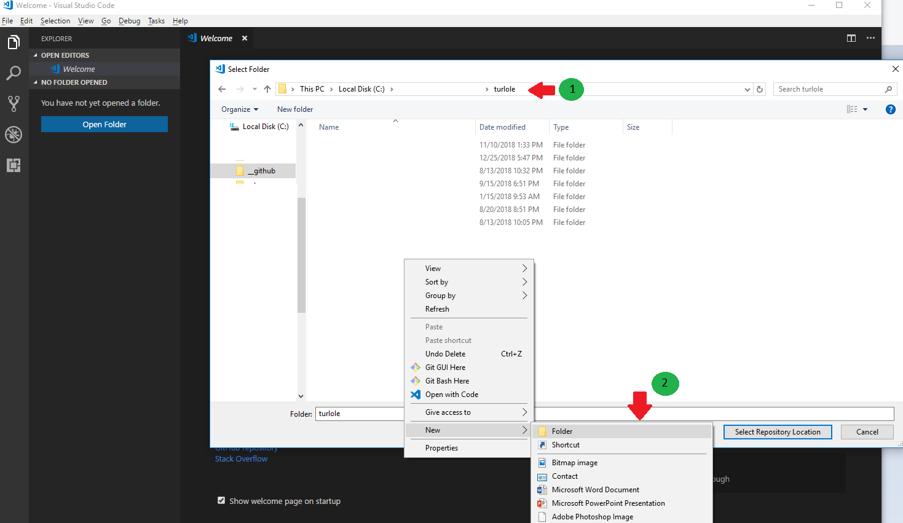
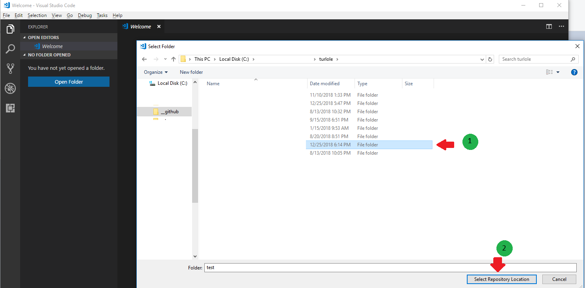
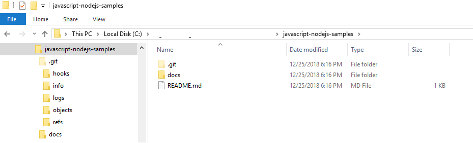

# Introduction: Workspace Setup
* * *

// [Home](./README.md) //

This documenation covers the following:

1. Install application: git
2. Install application: NodeJS
3. Install application: VSCode
4. Install VSCode extension: gitlens

## git
* * *

Download link: [Git for Windows](https://git-scm.com/download/win)

## NodeJS
* * *

Download link: [NodeJS Installer](https://nodejs.org/en/download/)

## VSCode
* * *

Download link: [Visual Studio Code](https://code.visualstudio.com/download)

## VSCode: Install extension - gitlens
* * *

### Install
* * *

Step 1: 

Step 2: 

Step 3: 

Copy and paste the following text as the Repository URI: https://github.com/turlole/javascript-nodejs-samples.git

Step 4: 

Step 5: 

Step 6: 

Step 7: 

Step 8: 

Step 9: 

### Setup and link to git repository
* * *

### Your first git commit and push
* * *

--

// [Home](./README.md) //

-- End
